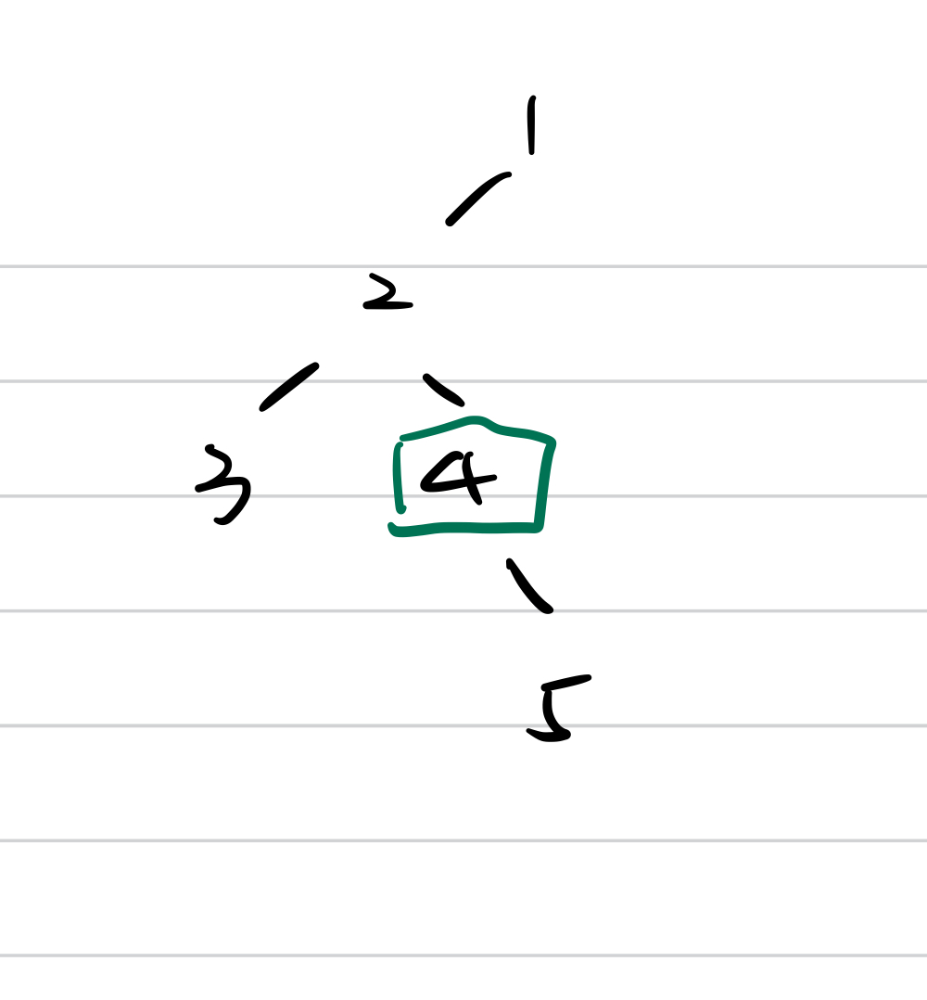

- [Bottom Up Recursive VS Top Down Recursive](#bottom-up-recursive-vs-top-down-recursive)
- [Ancestor Problems](#ancestor-problems)
  - [235. Lowest Common Ancestor of a Binary Search Tree](#235-lowest-common-ancestor-of-a-binary-search-tree)
  - [236. Lowest Common Ancestor of a Binary Tree](#236-lowest-common-ancestor-of-a-binary-tree)
  - [1026. Maximum Difference Between Node and Ancestor](#1026-maximum-difference-between-node-and-ancestor)
  - [1123. Lowest Common Ancestor of Deepest Leaves](#1123-lowest-common-ancestor-of-deepest-leaves)
- [Depth](#depth)
  - [110. Balanced Binary Tree](#110-balanced-binary-tree)
  - [513. Find Bottom Left Tree Value](#513-find-bottom-left-tree-value)
- [BST](#bst)
  - [530. Minimum Absolute Difference in BST](#530-minimum-absolute-difference-in-bst)
  - [95. Unique Binary Search Trees II](#95-unique-binary-search-trees-ii)
- [Path](#path)
  - [124. Binary Tree Maximum Path Sum](#124-binary-tree-maximum-path-sum)
  - [129. Sum Root to Leaf Numbers](#129-sum-root-to-leaf-numbers)
  - [113. Path Sum II](#113-path-sum-ii)
  - [437. Path Sum III](#437-path-sum-iii)
    - [Method1](#method1)
    - [Method2 Prefix Sum](#method2-prefix-sum)


## Bottom Up Recursive VS Top Down Recursive
Most of the tree problems should be resolved by recursive. Sometimes it's confusing whether we should pass parameter in the recursive or we should use the return result of the child in the recursive.

- Top Down recursive: we pass the parameter from the parent to children, so most of time no return value
- Bottom Up recursive: we need to use the result of the subproblem, hence most of time we have return value


## Ancestor Problems
### [235. Lowest Common Ancestor of a Binary Search Tree](https://leetcode.com/problems/lowest-common-ancestor-of-a-binary-search-tree/)
Given a binary search tree (BST), find the lowest common ancestor (LCA) of two given nodes p, q in the BST.

Intuition: If p and q are both in the left subtree, we go to the left subtree; If p and q are both in the right subtree, we search the right subtree. Otherwise, the LCA is root itself.
```python
class Solution:
    def lowestCommonAncestor(self, root: 'TreeNode', p: 'TreeNode', q: 'TreeNode') -> 'TreeNode':
        if not root:
            return None
        if p.val > root.val and q.val > root.val:
            return self.lowestCommonAncestor(root.right, p, q)
        if p.val < root.val and q.val < root.val:
            return self.lowestCommonAncestor(root.left, p, q)
        return root
```


### [236. Lowest Common Ancestor of a Binary Tree](https://leetcode.com/problems/lowest-common-ancestor-of-a-binary-tree/)
Instead of a BST, we are given a binary tree, how to find the LCA for p and q?

Intuition: If we find p and q in left and right subtree, root is the ancestor. If we find one in left, but don't find another one in right, it means the other one is the child of the found one.

```python
class Solution:
    def lowestCommonAncestor(self, root: 'TreeNode', p: 'TreeNode', q: 'TreeNode') -> 'TreeNode':
        if not root:
            return None
        if root == p or root == q:
            return root
        left = self.lowestCommonAncestor(root.left, p, q)
        right = self.lowestCommonAncestor(root.right, p, q)
        
        if left and right: # if p and q in left and right
            return root
        return left if left else right 
```
### [1026. Maximum Difference Between Node and Ancestor](https://leetcode.com/problems/maximum-difference-between-node-and-ancestor/)
Given the root of a binary tree, find the maximum value v for which there exist different nodes a and b where v = |a.val - b.val| and a is an ancestor of b.

A node a is an ancestor of b if either: any child of a is equal to b or any child of a is an ancestor of b.

Intuition: the max difference must be the difference between the maximum value and minimum value.

Bottom-up: we return the min and max of both left and right subtree.

```python
class Solution:
    def maxAncestorDiff(self, root: Optional[TreeNode]) -> int:
        def helper(root: Optional[TreeNode]) -> List[int]:
            nonlocal res
            if not root:
                return [float('inf'), -float('inf')]
            lefts = helper(root.left)
            rights = helper(root.right)

            mini = min(root.val, lefts[0], rights[0])
            maxi = max(root.val, lefts[1], rights[1])
            
            res = max(res, abs(root.val - mini), abs(root.val - maxi))
            
            return [mini, maxi]
        
        res = 0
        
        helper(root)
        return res
```

Top-down: we pass the min and max down to the child
```python
class Solution:
    def maxAncestorDiff(self, root: Optional[TreeNode]) -> int:
        def helper(root: Optional[TreeNode], curr_max: int, curr_min: int) -> int:
            if not root:
                return curr_max - curr_min
            
            curr_max = max(root.val, curr_max)
            curr_min = min(root.val, curr_min)
            
            left = helper(root.left, curr_max, curr_min)
            right = helper(root.right, curr_max, curr_min)
            
            return max(left, right)
        
        return helper(root, root.val, root.val)
```
### [1123. Lowest Common Ancestor of Deepest Leaves](https://leetcode.com/problems/lowest-common-ancestor-of-deepest-leaves/) 
It's the same proble with [865. Smallest Subtree with all the Deepest Nodes](https://leetcode.com/problems/smallest-subtree-with-all-the-deepest-nodes/)

1. Method 1 - use BFS to find the last level's node, the result should be the ancestor of the last level's first and last node
2. Method 2 - DFS
   
   Intuition: 
   
   From bottom to up, 
   
   - if the node's left depth == right depth, then the node is the result. 
  
   - if the node's right depth > left depth, then return the node's right
  

  Since we need both the child tree's depth and the returned value from child, the return value structure is (TreeNode, int)
  ```python
  class Solution:
    def subtreeWithAllDeepest(self, root: TreeNode) -> TreeNode:

        def helper(root: TreeNode) -> (TreeNode, int):
            if not root:
                return (None, 0) 
            left = helper(root.left)
            right = helper(root.right)
            
            left_depth = left[1]
            right_depth = right[1]
            
            if left_depth == right_depth:
                return (root, 1+left_depth)
            if left_depth > right_depth:
                return (left[0], 1 + left_depth)
            return (right[0], 1 + right_depth)
        
        return helper(root)[0]
  ```
## Depth
### [110. Balanced Binary Tree](https://leetcode.com/problems/balanced-binary-tree/)
Given a binary tree, determine if it is height-balanced.

For this problem, a height-balanced binary tree is defined as:

> a binary tree in which the left and right subtrees of every node differ in height by no more than 1.

The simple way is to check from up to bottom:
```python
class Solution:
    def isBalanced(self, root: Optional[TreeNode]) -> bool:
        if not root:
            return True
        return abs(self.depth(root.left) - self.depth(root.right)) <= 1 and self.isBalanced(root.left) and self.isBalanced(root.right)

    def depth(self, root: Optional[TreeNode]) -> int:
        if not root:
            return 0
        return max(self.depth(root.left), self.depth(root.right)) + 1
```
The time complexity is around $O(n\log n)$

The more efficient way is from bottom to up - whenever we find the unbalanced, we will stop the recursion.
```python
class Solution:
    def isBalanced(self, root: Optional[TreeNode]) -> bool:
        return self.dfs(root)[0]
    
    def dfs(self, root: Optional[TreeNode]) -> [bool, int]:
        if not root:
            return [True, 0]
        left, right = self.dfs(root.left), self.dfs(root.right)
        balanced = left[0] and right[0] and abs(left[1] - right[1]) <= 1
        return [balanced, max(left[1], right[1]) + 1 ]
```
- Time complexity : $O(n)$ - For every subtree, we compute its height in constant time as well as compare the height of its children.

### [513. Find Bottom Left Tree Value](https://leetcode.com/problems/find-bottom-left-tree-value/)

Given the root of a binary tree, return the leftmost value in the last row of the tree.

It's easy to resolve it by BFS. We can also use DFS -- we store the current depth of the tree, if it's larger than the saved height, than we update the result value.

```python
class Solution:
    def findBottomLeftValue(root: Optional[TreeNode]) -> int:
        self.h = 0 # tree height
        self.answer = 0
        def helper(root: Optional[TreeNode], depth: int) -> int:
            if depth > self.h:
                self.h = depth # update the height of tree
                self.answer = root.val
            if root.left:
                helper(root.left, depth + 1)
            if root.right:
                helper(root.right, depth + 1)
        
        helper(root, 1)
        return self.answer
```

## BST
### [530. Minimum Absolute Difference in BST](https://leetcode.com/problems/minimum-absolute-difference-in-bst/)
Given the root of a Binary Search Tree, return the minimum absolute difference between the values of any two different nodes in the tree.

Intuition: The mimimum absolute difference must be the adjacent nodes in **in-order** traversal.


```python
class Solution:
    def geMinimumDiff(self, root: Optional[TreeNode]) -> int:
        self.min_diff = float('inf')
        self.prev = float('-inf')
        self.dfs(root)
        return self.min_diff

    def dfs(self, root: Optional[TreeNode]) -> int:
        if not root:
            return
        self.dfs(root.left)
        # calculate the diff with prev
        self.min_diff = min(min_diff, root.val - prev)
        # change curr as prev val
        self.prev = root.val
        self.dfs(root.right)

```


### [95. Unique Binary Search Trees II](https://leetcode.com/problems/unique-binary-search-trees-ii/)

## Path
### [124. Binary Tree Maximum Path Sum](https://leetcode.com/problems/binary-tree-maximum-path-sum/)


### [129. Sum Root to Leaf Numbers](https://leetcode.com/problems/sum-root-to-leaf-numbers/)

### [113. Path Sum II](https://leetcode.com/problems/path-sum-ii/)

Given the root of a binary tree and an integer targetSum, return all root-to-leaf paths where the sum of the node values in the path equals targetSum. Each path should be returned as a list of the node values, not node references.

For example, targetSum = 22, then the path would be [[5,4,11,2], [5,8,4,5]]


Since it's root-to-leaf, we can pass the currSum to children to add, and when we reach the leaf, we check whether currSum equals targetSum, if yes, we add curr path to list. Remember: whenever we go back to the upper level, we should pop up the current val out of the current path.

```python
class Solution:
    def pathSum(self, root: Optional[TreeNode], targetSum: int) -> List[List[int]]:
        def helper(root: Optional[TreeNode], currSum: int, curr: List[int]):
            nonlocal res
            if not root:
                return
            
            curr.append(root.val)
            currSum += root.val

            # left node
            if not root.left and not root.right and currSum == targetSum:
                res.append(curr.copy()) # remember copy here, otherwise the latter change will impact the result
                curr.pop() # go back to upper level, pop out
                return
            
            helper(root.left, currSum, curr)
            helper(root.right, currSum, curr)
            curr.pop()
        
        res = []
        helper(root, 0, [])
        return res

```


### [437. Path Sum III](https://leetcode.com/problems/path-sum-iii/)
Given the root of a binary tree and an integer targetSum, return the number of paths where the sum of the values along the path equals targetSum.

The path does not need to start or end at the root or a leaf, but it must go downwards (i.e., traveling only from parent nodes to child nodes).


#### Method1
The sum of the node to its children is either current node's val plus possible children sums or the current node's val itself.


```python
class Solution:
    def pathSum(self, root: Optional[TreeNode], targetSum: int) -> int:
        def helper(root: Optional[TreeNode]) -> list[int]:
            nonlocal sum_num, targetSum
            if not root:
                return []
            res = [root.val]
            if root.val == targetSum:
                sum_num += 1
            left = helper(root.left)
            right = helper(root.right)

            for sub_sum in left + right:
                if sub_sum + root.val == targetSum:
                    sum_num += 1
                res.append(sub_sum + root.val)
            return res
            
        sum_num = 0
        helper(root)
        return sum_num
```

#### Method2 Prefix Sum


```python
class TreeNode:
    def __init__(self, val=0, left=None, right=None):
        self.val = val
        self.left = left
        self.right = right

class Solution:
    def pathSum(self, root: Optional[TreeNode], targetSum: int) -> int:
        # Since it's up down, we have no return value but pass parameter currsum to the children
        def helper(root: Optional[TreeNode], currSum: int):
            nonlocal sum_num, targetSum
            if not root:
                return
            currSum += root.val
            if currSum == targetSum:
                sum_num += 1
            if currSum - targetSum in dict_t.keys():
                sum_num += dict_t.get(currSum-targetSum)
            dict_t[currSum] = dict_t[currSum] + 1 if currSum in dict_t else 1
            helper(root.left, currSum)
            helper(root.right, currSum)
            dict_t[currSum] -= 1
        
        sum_num = 0
        dict_t = {}
        helper(root, 0)
        return sum_num

```